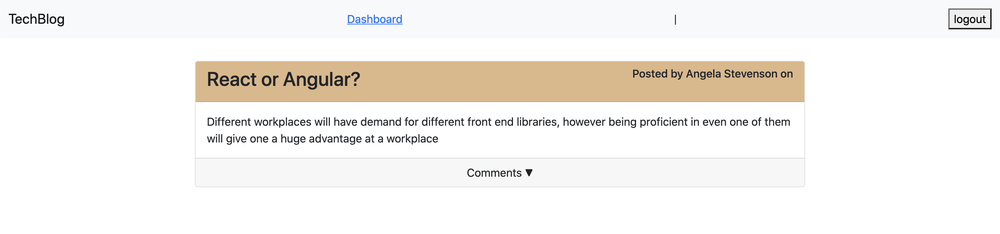
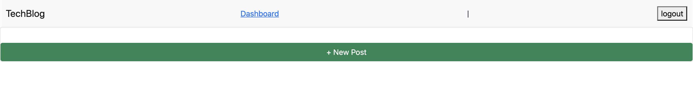
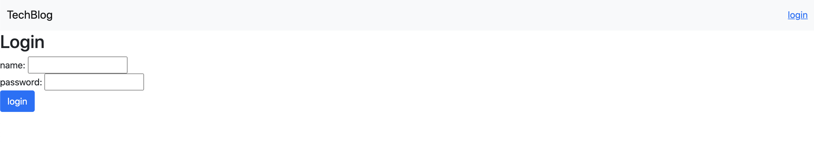

# Tech Blog 

   
  Application allows user to create a profile and post blogs. The user can update and delete posts as well. Leaving comments is part of the functionality too. 

   

   [Deployed last version](https://limitless-reaches-70428.herokuapp.com/)

   [Github repo](https://github.com/Amal31497/tech-blog)

   

  ## Table of Contents 
 
  ##### * [Technologies used](#Technologies)
  ##### * [Usage walkthrough](#Walkthrough)
  ##### * [Installation](#Installation)
  ##### * [Credits](#Credits)
  ##### * [License](#License)
  ##### * [Contact Info](#Contact)

  ## Technologies:
   _*HTML,CSS,Javascript,Jquery,Node.js,Bootstrap,Heroku App,Others*_

  ## Walkthrough:
  #### Video:
  Please follow this *[link](https://youtu.be/UyhzCw0iQPo)* to watch the walkthrough video.

  #### Screenshots:
  
  
  

  ## Installation:
  Run the following commands in your integrated terminal to initalize the application:

    1. git clone [Repository link you can find under "code" button] (To get the code from a repo)

    2. npm install

    3. npm run watch

    4. Follow the walthrough video for help

    5. Enjoy!
    
    
  ## Contributing:
    To contribute to this repo:

     - Fork the repo
     - Make changes to forked repo
     - Submit a pull request to this repo
  
  ## Credits:
  [w3schools.com](w3schools.com)
  [MDN](MDN)
  

  ## License: 

  ##### Copyright: Amal Janabayev

  ##### 

  ##### [License Link](https://opensource.org/licenses/MIT)

  ## Contact: 

  ##### amalj2426@gmail.com
